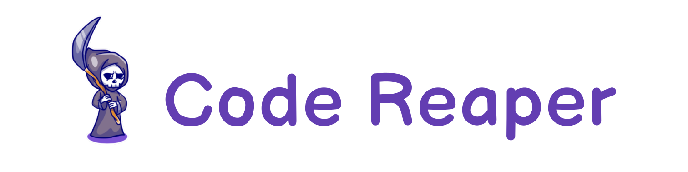

---

   

 Hey there, it's your friendly neighborhood CodeReaper, aka Shivam Shandilya. A tech-loving undergrad. I like to tinker with Linux, work on data science and web development. In my free time, I experiment in the kitchen (emphasis on "experiment") and binge-watch anime. But, I'm not just a foodie and anime fan; I'm also passionate about tech and believe in making a positive impact through open source projects. Want to connect or collaborate? Drop me a line!

##  Tech Stack

## 🧰 Frameworks and Tools

##  GitHub Stats

  
  

##  Latest Tweet

##   Recent Jams

